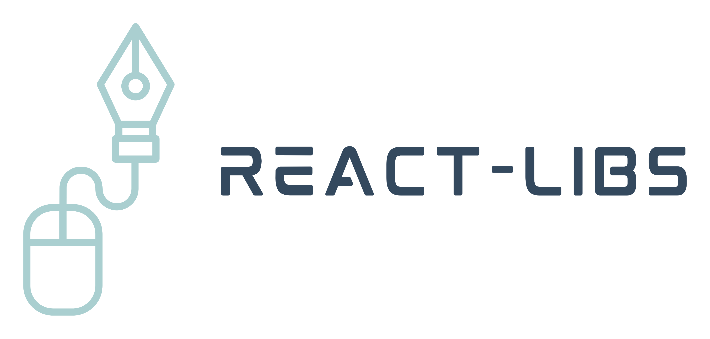

<div align="center">



Encuentra informacion util, datos, herramientas, bibliotecas, consejos, guias y mas.

Mejora tu nivel de desarrollo de React
<a href="https://github.com/Tono2007/React-Libs?style=social/issues">
  
</a>
<a href="https://github.com/Tono2007/React-Libs/graphs/contributors">
  
</a>
<a href="https://github.com/Tono2007/React-Libs/pulls">
    
</a>

[](./LICENSE)

<p align="center">
  <strong>
  <a href="https://react-libs.vercel.app/">Sitio</a> •
  <a href="https://react-libs.vercel.app/docs">Documentación</a>  
  </strong>
</p>

</div>

---


# Website

React Libs esta contruido con [Docusaurus 2](https://docusaurus.io/), un moderno generador de sitios estaticos, especializado en documentación.

# Como contribuir

Estoy muy contento de que estés leyendo esto, porque necesitamos desarrolladores voluntarios para ayudar a que este proyecto se haga realidad.

Aquí hay algunos puntos importantes:

- [React Libs](https://react-libs.vercel.app/) aqui se encuentra nuestro sitio.
- Bugs? [Issues](https://github.com/Tono2007/React-Libs/issues) aqui puedes reportarlos.
- Todo contenido que no sea de tu autoria debe estar **referenciado/citado**.
- Documentación: editing, writing, illustrating, example code.
- Design: design, diagram system.
- Development: site development,sandbox integration.
- El dueño del repositorio puede escoger a quien agregar como _miembro_ del repositorio.
- Si es podible, testea los cambios visuales en las ultimas versiones de los navegadores mas populares, en escritorio y movil.

También estamos agradecidos con todos los voluntarios que tradujeron React-Libs a otros idiomas.

## Submitting changes

Envíe una [GitHub Pull Request a React Libs](https://github.com/Tono2007/React-Libs/pull/new/main) con una lista clara de lo que ha hecho (lea más sobre [pull requests](http://help.github.com/pull-requests/)). Cuando envíe una pull request, nos encantaria si agregas ejemplos de código. Siga nuestras convenciones de codificación (a continuación) y asegúrese de que todos sus commits sean atómicos (una característica por commit).

Siempre escriba un mensaje de registro claro para sus commits. Los mensajes de una línea están bien para pequeños cambios.

    $ git commit -m "[ADD],[UPDATE],[FEAT],[FIX],[DELETE] A brief summary of the commit
    >
    > A paragraph describing what changed and its impact."

## Submitting changes

Please send a [GitHub Pull Request to React Libs](https://github.com/Tono2007/React-Libs/pull/new/main) with a clear list of what you've done (read more about [pull requests](http://help.github.com/pull-requests/)). When you send a pull request, we will love you forever if you include code examples. Please follow our coding conventions (below) and make sure all of your commits are atomic (one feature per commit).

Always write a clear log message for your commits. One-line messages are fine for small changes

    $ git commit -m "[ADD],[UPDATE],[FEAT],[FIX],[DELETE] A brief summary of the commit
    >
    > A paragraph describing what changed and its impact."

## Coding conventions

Start reading our code and you'll get the hang of it. We optimize for readability:
In short we use `@docusaurus/eslint-plugin`, thanks.

### Installation

```
$ yarn
$ npm i
```

### Local Development

```
$ yarn start
& npm start
```

_Licencia MIT_ Esta licencia es una Licencia de software libre permisiva.
