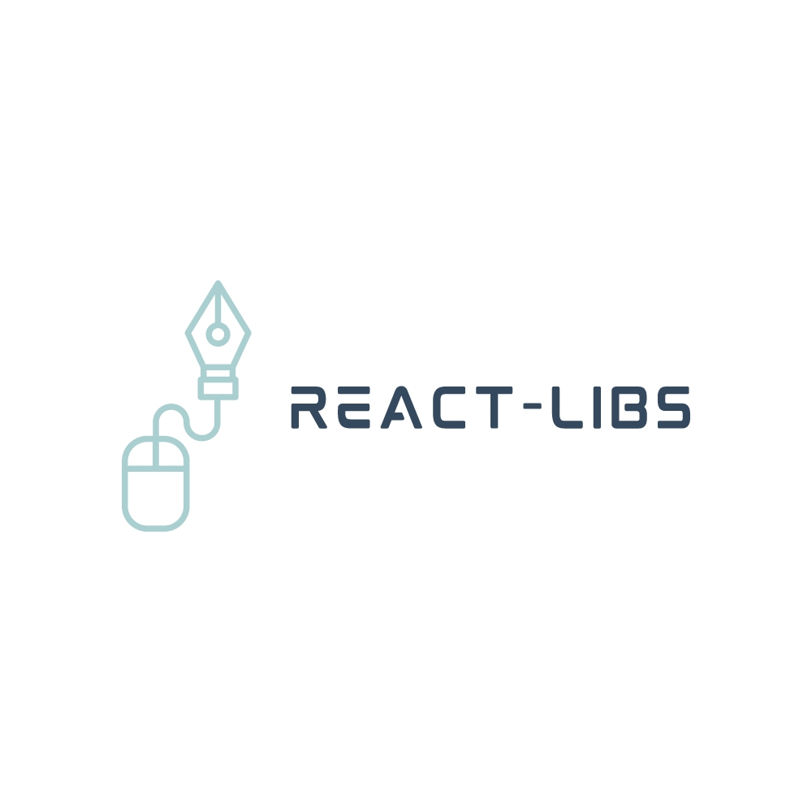

<div align="center">
public/assets/screenshots/screenshot-3.webp
[](https://github.com/Tono2007/React-Libs)

Encuentra informacion util, datos, herramientas y librerias

 

[](./LICENSE)

<p align="center">
  <strong>
  <a href="https://react-libs.vercel.app/">Sitio</a> •
  <a href="https://react-libs.vercel.app/docs/intro">Documentation</a>  
  </strong>
</p>

</div>

---


# Website

This website is built using [Docusaurus 2](https://docusaurus.io/), a modern static website generator.

### Installation

```
$ yarn
```

### Local Development

```
$ yarn start
```

This command starts a local development server and opens up a browser window. Most changes are reflected live without having to restart the server.

### Build

```
$ yarn build
```

This command generates static content into the `build` directory and can be served using any static contents hosting service.

### Deployment

Using SSH:

```
$ USE_SSH=true yarn deploy
```

Not using SSH:

```
$ GIT_USER=<Your GitHub username> yarn deploy
```

If you are using GitHub pages for hosting, this command is a convenient way to build the website and push to the `gh-pages` branch.
